 
👋 Hey, I'm Praveen Kumar!

 I'm Praveen Kumar, a 3rd Year B.Tech Artificial Intelligence & Data Science student passionate about building practical software and AI-powered applications.

I enjoy working at the intersection of:

🤖 Artificial Intelligence & Machine Learning

🌐 Full Stack Web Development

🐍 Python Development

⚛️ React & React Native

⚙️ Backend APIs & Automation

🗄️ MySQL & Databases

🚀 Real-world Problem Solving

 ---

⚡ What I'm Currently Doing

<table>
<tr>
<td width="50%">🤖 AI / ML

• Learning Machine Learning & Deep Learning

• Exploring Computer Vision

• Working with OpenCV

• Exploring YOLO-based applications

• Learning practical AI development

• Building AI-oriented projects

</td><td width="50%">🌐 Full Stack Development

• Building React applications

• Learning Node.js & Express

• Developing Python APIs

• Working with FastAPI

• Connecting frontend with REST APIs

• Working with MySQL & MongoDB

</td>
</tr>
</table>---

🧰 Tech Arsenal

💻 Programming Languages

⚛️ Frontend Development

📱 Mobile Development

React Native • Expo

⚙️ Backend & APIs

🗄️ Databases

🤖 AI / Computer Vision

🛠️ Tools

🔄 Automation

n8n • REST APIs • Webhooks • ngrok

---

🚀 Featured Projects

🚀 Project| 🧠 What I Built| 🔧 Technologies
🚌 Bus Destination Alarm| Application concept that monitors the user's location and triggers an alarm when the destination is a few kilometers away| React • React Native • Expo • Python • GPS
📝 Leave Desk| Employee leave management system with employee search, leave requests, OTP verification and manager approval workflow| HTML • CSS • JavaScript • n8n • Webhooks
📊 Project Pulse| Project monitoring application designed to manage and monitor project progress| React • Node.js • Express • MongoDB
📝 Student Feedback System| Full-stack student feedback platform with student/admin workflow and database integration| HTML • CSS • JavaScript • FastAPI • MySQL
🛒 Food Cart| Responsive food shopping application with routing and shared application state| React • React Router • Context API
🌦️ Weather Application| Weather application using an external weather API to retrieve and display weather information| React • JavaScript • REST API
🔳 QR Generator| Web application for generating QR codes dynamically| React • JavaScript
🐍 Snake & Ladder| Multiplayer browser-based Snake & Ladder game| HTML • CSS • JavaScript
🎨 Vibe Coding| Creative frontend experiments focused on UI, animations and responsive design| HTML • CSS • JavaScript
🖥️ Collaborative Whiteboard| Web-based collaborative drawing/whiteboard application concept| React • JavaScript • Web Technologies

---

💡 What I Like Building

I prefer projects that solve a real problem instead of projects that only demonstrate a technology.

Some areas I'm particularly interested in:

🤖 AI-powered Applications

🌐 Full Stack Web Applications

📱 Mobile Applications

🗺️ Location-based Applications

⚙️ Automation & Workflow Systems

🔌 REST API Based Applications

🗄️ Database-driven Systems

---

🧠 My Learning Journey

                    ┌─────────────────────┐
                    │    PRAVEEN KUMAR    │
                    │     AI & DS Student │
                    └──────────┬──────────┘
                               │
              ┌────────────────┼────────────────┐
              ▼                ▼                ▼
          💻 Coding         🤖 AI/ML          🌐 Web
              │                │                │
      Python / JavaScript   ML / DL          HTML / CSS
      Java / C             OpenCV            JavaScript
              │             YOLO              React
              │                │                │
              └────────────────┼────────────────┘
                               ▼
                        ⚙️ Backend
                               │
                    ┌──────────┴──────────┐
                    ▼                     ▼
                 Python                Node.js
               FastAPI / Flask        Express.js
                    │                     │
                    └──────────┬──────────┘
                               ▼
                         🗄️ Databases
                               │
                         MySQL / MongoDB
                               │
                               ▼
                         🚀 Real Projects
                               │
                               ▼
                    🔥 Build • Deploy • Learn

---
# 📊 GitHub Activity

  

🏆 What I Like Working With

🤖 AI / Machine Learning
██████████████████░░

🌐 Full Stack Development
███████████████████░

🐍 Python Development
████████████████████

⚛️ React Development
██████████████████░░

⚙️ Backend & APIs
█████████████████░░░

🗄️ Databases
████████████████░░░░

📱 Mobile Development
███████████████░░░░░

🔥 Real-world Projects
████████████████████

---

🎯 My Goals

🚀 Become a strong AI & Software Development professional

🧠 Improve practical Machine Learning & Deep Learning skills

🌐 Build production-style full-stack applications

📱 Develop useful mobile applications

⚙️ Improve my backend and API development skills

💡 Participate in more hackathons & coding competitions

🗣️ Improve communication, confidence and interview skills

🌍 Contribute to meaningful open-source projects

🔥 Keep building instead of only learning

---

📚 Currently Learning

React

→ Components → Props → State → Hooks → Context API → Routing

Backend

→ Node.js → Express → REST APIs → Authentication → Webhooks

Python Backend

→ Flask → FastAPI → REST APIs → Database Integration

Databases

→ MySQL → MongoDB → CRUD Operations

AI / ML

→ Machine Learning → Deep Learning → Computer Vision

Mobile

→ React Native → Expo → Location-based Applications

---

🌐 Let's Connect

---

💭 Developer Mindset

 ⭐ Explore my repositories • Build something useful • Keep learning

  

  

